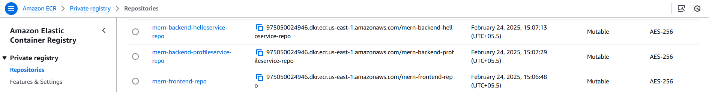
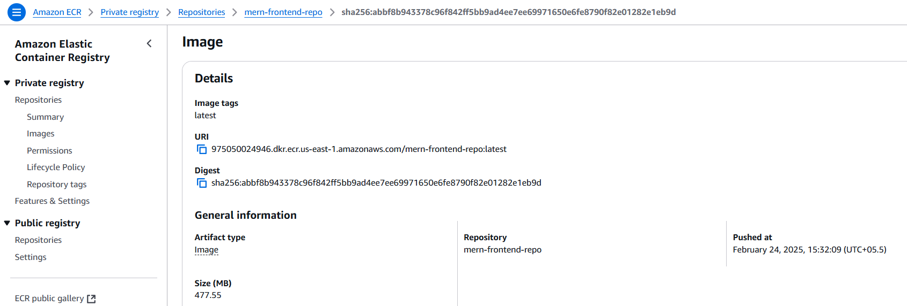
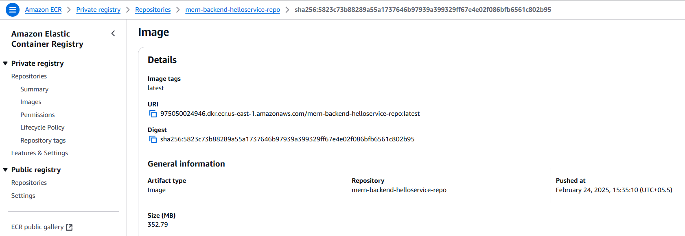
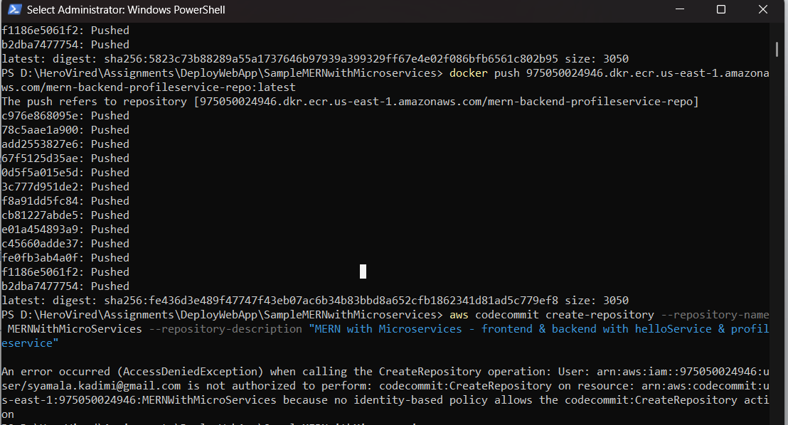

# Graded Assignment : Project: Deploying and Scaling Web Application

## Objective


---

## Prerequisites
Make sure you have the following installed on your system:
1. AWS CLI
2. Python and pip

---

## Instructions

### 1. AWS Environment setup
1. Install AWS CLI for windows from official website
2. Verify the installation
    ```bash
        aws --version
    ```
3. Configure AWS CLI:
    Run the following command and enter your AWS Access Key, Secret Key, Region, and Output format. You can get Access Key & Secret Key from AWS IAM policies
    ```bash
        aws configure
    ```
4. Install Boto3
    ```bash
        pip install boto3
    ```
---

### 2. Code setup
1. Fork the repository https://github.com/UnpredictablePrashant/SampleMERNwithMicroservices to https://github.com/SyamalaKadmi/SampleMERNwithMicroservices.git
2. Clone the repository
    ```bash
     git clone https://github.com/SyamalaKadmi/SampleMERNwithMicroservices.git
    ```
---

### 3. Containerize the MERN Application
1. Create .env files for helloService & ProfileService in backend
    - helloService
        ```
            PORT=3001
        ```
    - profileService
        ```
            PORT=3002
            MONGO_URL="specifyYourMongoURLHereWithDatabaseNameInTheEnd"
        ```
2. Create docker files for frontend and backend (helloService & profileService) respectively
    - helloservice [HelloServiceDockerfile](backend/helloService/Dockerfile)
    - profileservice [profileServiceDockerfile](backend/profileService/Dockerfile)
    - frontendservice [frontendDockerfile](frontend/Dockerfile)
3. Build the docker images
    ```bash
    cd ./SampleMERNwithMicroservices
    docker build -t mern-frontend-image ./frontend
    docker build -t mern-backend-helloservice-image ./backend/helloService
    docker build -t mern-backend-profileservice-image ./backend/profileservice
    ```
4. Push Docker Images to Amazon ECR:
    1. Create a reppository for each image
        ```bash
            aws ecr create-repository --repository-name mern-frontend-repo
            aws ecr create-repository --repository-name mern-backend-helloservice-repo
            aws ecr create-repository --repository-name mern-backend-profileservice-repo
        ```
        
    2. Authenticate Docker to ECR
        ```bash
            aws ecr get-login-password --region <region> | docker login --username AWS --password-stdin <account-id>.dkr.ecr.<region>.amazonaws.com
        ```
    3. Tag and push the docker images to the ECR
        - Frontend
        ```bash
            docker tag mern-frontend-image:latest 975050024946.dkr.ecr.us-east-1.amazonaws.com/mern-frontend-repo:latest
            docker push 975050024946.dkr.ecr.us-east-1.amazonaws.com/mern-frontend-repo:latest
        ```
        

        - backend - helloService
        ```bash
            docker tag mern-backend-helloservice-image:latest 975050024946.dkr.ecr.us-east-1.amazonaws.com/mern-backend-helloservice-repo:latest
            docker push 975050024946.dkr.ecr.us-east-1.amazonaws.com/mern-backend-helloservice-repo:latest
        ```
        

        - backend - profileService
        ```bash
            docker tag mern-backend-profileservice-image:latest 975050024946.dkr.ecr.us-east-1.amazonaws.com/mern-backend-profileservice-repo:latest
            docker push 975050024946.dkr.ecr.us-east-1.amazonaws.com/mern-backend-profileservice-repo:latest
        ```
        

---

### 4. Version Control
1. Create CodeCommit Repository
    ```bash
        aws codecommit create-repository --repository-name MERNWithMicroServices --repository-description "MERN with Microservices - frontend & backend with helloService & profileservice"
    ```
    Proceeding with Github as code repository due to permission issues
    
2. Jenkins Setup & Configuration
    1. Using the existing Jenkins server to configure

    
