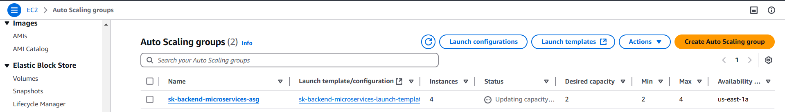

# Graded Assignment : Project: Deploying and Scaling Web Application

## Objective
This project deploys a MERN stack application (Frontend, HelloService, ProfileService) on AWS using Kubernetes (EKS), Jenkins, Helm, and Boto3. It follows a CI/CD pipeline, Auto Scaling, and monitoring using CloudWatch, Prometheus, and Grafana.

---

## Prerequisites
Make sure you have the following installed on your system:
1. AWS CLI
2. Python and pip

---

## Instructions

### 1. AWS Environment setup
1. Install AWS CLI for windows from official website
2. Verify the installation
    ```bash
        aws --version
    ```
3. Configure AWS CLI:
    Run the following command and enter your AWS Access Key, Secret Key, Region, and Output format. You can get Access Key & Secret Key from AWS IAM policies
    ```bash
        aws configure
    ```
4. Install Boto3
    ```bash
        pip install boto3
    ```
---

### 2. Code setup
1. Fork the repository https://github.com/UnpredictablePrashant/SampleMERNwithMicroservices to https://github.com/SyamalaKadmi/SampleMERNwithMicroservices.git
2. Clone the repository
    ```bash
     git clone https://github.com/SyamalaKadmi/SampleMERNwithMicroservices.git
    ```
---

### 3. Containerize the MERN Application
1. Create .env files for helloService & ProfileService in backend
    - helloService
        ```
            PORT=3001
        ```
    - profileService
        ```
            PORT=3002
            MONGO_URL="specifyYourMongoURLHereWithDatabaseNameInTheEnd"
        ```
2. Create docker files for frontend and backend (helloService & profileService) respectively
    - helloservice [HelloServiceDockerfile](backend/helloService/Dockerfile)
    - profileservice [profileServiceDockerfile](backend/profileService/Dockerfile)
    - frontendservice [frontendDockerfile](frontend/Dockerfile)
3. Build the docker images
    ```bash
    cd ./SampleMERNwithMicroservices
    docker build -t mern-frontend-image ./frontend
    docker build -t mern-backend-helloservice-image ./backend/helloService
    docker build -t mern-backend-profileservice-image ./backend/profileservice
    ```
4. Push Docker Images to Amazon ECR:
    1. Create a reppository for each image
        ```bash
            aws ecr create-repository --repository-name mern-frontend-repo
            aws ecr create-repository --repository-name mern-backend-helloservice-repo
            aws ecr create-repository --repository-name mern-backend-profileservice-repo
        ```
        
    2. Authenticate Docker to ECR
        ```bash
            aws ecr get-login-password --region <region> | docker login --username AWS --password-stdin <account-id>.dkr.ecr.<region>.amazonaws.com
        ```
    3. Tag and push the docker images to the ECR
        - Frontend
        ```bash
            docker tag mern-frontend-image:latest 975050024946.dkr.ecr.us-east-1.amazonaws.com/mern-frontend-repo:latest
            docker push 975050024946.dkr.ecr.us-east-1.amazonaws.com/mern-frontend-repo:latest
        ```
        

        - backend - helloService
        ```bash
            docker tag mern-backend-helloservice-image:latest 975050024946.dkr.ecr.us-east-1.amazonaws.com/mern-backend-helloservice-repo:latest
            docker push 975050024946.dkr.ecr.us-east-1.amazonaws.com/mern-backend-helloservice-repo:latest
        ```
        

        - backend - profileService
        ```bash
            docker tag mern-backend-profileservice-image:latest 975050024946.dkr.ecr.us-east-1.amazonaws.com/mern-backend-profileservice-repo:latest
            docker push 975050024946.dkr.ecr.us-east-1.amazonaws.com/mern-backend-profileservice-repo:latest
        ```
        

---

### 4. Version Control
1. Create CodeCommit Repository
    ```bash
        aws codecommit create-repository --repository-name MERNWithMicroServices --repository-description "MERN with Microservices - frontend & backend with helloService & profileservice"
    ```
    Proceeding with Github as code repository due to permission issues
    
2. Jenkins Setup & Configuration
    1. Setup a Jenkins server on ec2 instance
    2. GitHub Access Token: Create a personal access token with ```repo``` and ```admin:repo_hook``` permissions in Github
    3. Install required plugins on Jenkins Server - GitHub Integration, Docker Pipeline, Amazon ECR, Pipeline
    4. Configure Github credentials in Jenkins. 
        - Go to Jenkins Dashboard -> Manage Jenkins -> Credentials -> System -> Global credentials (unrestricted) -> Add Credentials
        - Add Kind: Secret text, Secret Github Personal Access Token, ID: github-token, Description: GitHub Token for Jenkins
3. Create a Jenkins Pipeline Job
    1. Go to Jenkins Dashboard -> New Item
    2. Enter the job name (e.g., MERN-CI-CD-Pipeline) and select Pipeline and Click Ok
    3. Add the Github url -- https://github.com/SyamalaKadmi/SampleMERNwithMicroservices.git
    4. Under Build Triggers: Check GitHub hook trigger for GITScm polling. This allows Jenkins to trigger builds on new commits.
    5. Add the Pipeline script --> JenkinsFile
4. Configure Webhook 
    1. In GitHub Repository, go to settings -> Webhooks -> Add Webhook -> Payload url 
        ```
            http://<EC2-Public-IP>:8080/github-webhook/
        ```
        Content type: Application/json
        Choose Just the push event and click Add webhook
5. Validation 
    1. Verify the Jenkins pipeline is running successfully after a commit is made to repository
        
    2. Verify images to pushed to AWS ECR
        - Frontend
        
        - backend/helloService
        
        - backend/profileService
        

---

### 5. Infrastructure as Code (IaC) with Boto3
Create a python script [setup_infrastructure.py](setup_infrastructure.py) to 
    - create VPC with public & private subnets
    - setup security groups for frontend & backend
    Verification - 
    

---

### 6. Deploying Backend Services
1. Create a launch template with details of deployment of helloService & ProfileService for backend using python script - [create_launch_template.py](create_launch_template.py)
    
2. Create ASG using [create_asg.py](create_asg.py)
Verification: 
    - Run the script and verify its successfully ran
    ```bash
        python3 create_asg.py
    ```
    
    - Verify that its created in AWS console
    

---

### 7. Set Up Networking
1. Create a load balancer for the backend ASG using [create_load_balancer.py](create_load_balancer.py)
    
2. Configure DNS using [configure_route53.py](configure_route53.py)

---

### 8. Deploying Frontend Services
1. Create a launch template with details of frontend deployment using [create_frontend_launch_template.py](create_frontend_launch_template.py)
    
2. Create ASG using [create_frontend_asg.py](create_frontend_asg.py)
3. Create a load balancer for frontend
4. Configure dns with Route 53 [configure_frontend_route53.py](configure_frontend_route53.py)

---

### 9. AWS Lambda deployment
1. Create an S3 bucket for storing backups - skbatch8
2. Create lambda function to store backups in S3 [create_lambda_db_backup.py](create_lambda_db_backup.py)
    ```
    python3 create_lambda_db_backup.py
    ```
3. Create cloudwatch event rule to run the Lambda function daily [create_cloudwatch_event.py]
    - Manually trigger the event and verify the logs
    - Confirm the presence of time-stamped backup files in the S3 bucket

---

### 10. Kubernetes (EKS deployment)
1. Make sure kubectl, Helm installed
2. An IAM role with AmazonEKSClusterPolicy and AmazonEKSWorkerNodePolicy permissions created
3. Write a python script to create EKS Cluster - [eks_cluster_config.yaml](eks_cluster_config.yaml)
    - Create the cluster using the below command
        ```bash
            eksctl create cluster -f eks_cluster_config.yaml
        ```
4. Configure kubectl
    ```bash
        aws eks update-kubeconfig --region us-east-1 --name mern-microservices-cluster
    ```
    Verify Cluster Connectivity:
    ```bash
        kubectl get nodes
    ```
5. Create Helm Charts 
    1. Make a directory called helm-charts and create helm-charts for each Services
    -  Frontend 
    ```bash
        helm create frontend
    ```
    -  helloservice
    ```bash
        helm create helloservice
    ```
    -  profileservice
    ```bash
        helm create profileservice
    ```
    2. edit the values.yaml in each service with ecr repo & load balancer requirements
    3. edit the deployment.yaml files in each service to update the image details & Connectivitydetails
    4. edit the service.yaml files to update the target port details
    5. Deploy each service using Helm Charts
        - Frontend
            ```bash
            helm install frontend helm-charts/frontend
            ```
        - HelloService
            ```bash
            helm install helloservice helm-charts/helloservice
            ```
        - ProfileService
            ```bash
            helm install profileservice helm-charts/profileservice
            ```
6. Create Ingress Controller
    1. Install Ingress
        ```bash
        kubectl apply -f https://raw.githubusercontent.com/kubernetes/ingress-nginx/main/deploy/static/provider/aws/deploy.yaml
        ```
    2. Create [ingress.yaml](ingress.yaml)
    3. Apply Ingress
        ```bash
        kubectl apply -f ingress.yaml
        ```
    4. Verify the deployments, pods and Services
        ```bash
        kubectl get deployments
        kubectl get pods
        kubectl get svc
        ```
    5. Check Ingress and fetch the load balancer dns to test the Application
        ```bash
        kubectl get ingress
        ```
    6. Test the application using:
        http://<loadbalancerdns> for Frontend
        http://<loadbalancerdns>/api/hello for HelloService
        http://<loadbalancerdns/api/profile for ProfileService

---

### 11. Monitoring and Logging
1. CloudWatch Monitoring
    - Enable Container Insighrs on EKS Cluster:
    ```bash
        aws eks update-cluster-config \
        --region us-east-1 \
        --name mern-microservices-cluster \
        --logging '{"clusterLogging":[{"types":["api","audit","authenticator","controllerManager","scheduler"],"enabled":true}]}'
    ```
    - Install CloudWatch Agent using Helm:
    ```bash
        helm repo add amazon-cloudwatch https://aws.github.io/eks-charts
        helm repo update
        helm install cloudwatch-agent amazon-cloudwatch/cloudwatch-agent \
            --set clusterName=mern-microservices-cluster \
            --set region=us-east-1 \
            --set logs.enabled=true \
            --set logs.logGroupName='/eks/mern-microservices'
    ```
    - Verify CloudWatch Agent installation:
    ```bash
        kubectl get pods -n amazon-cloudwatch
    ```
2. CloudWatch Alarms
    - Create Alarms for CPU Utilization, MemoryUtilization, 4xxErrorRate, 5xxErrorRate
    ```bash
        import boto3

        cloudwatch = boto3.client('cloudwatch', region_name='us-east-1')

        response = cloudwatch.put_metric_alarm(
            AlarmName='High-CPU-Utilization-Alarm',
            AlarmDescription='Triggered when CPU utilization exceeds 80%',
            ActionsEnabled=True,
            MetricName='CPUUtilization',
            Namespace='AWS/EKS',
            Statistic='Average',
            Period=300,
            EvaluationPeriods=2,
            Threshold=80.0,
            ComparisonOperator='GreaterThanThreshold',
            AlarmActions=[
                'arn:aws:sns:us-east-1:YOUR_AWS_ACCOUNT_ID:YOUR_SNS_TOPIC_NAME'
            ],
            Dimensions=[
            {
                'Name': 'ClusterName',
                'Value': 'mern-microservices-cluster'
            },
        ]
    )
    print("Alarm Created:", response)
    ```
    Edit the script with MetricName change to 'MemoryUtilization', '4xxErrorRate', '5xxErrorRate' to create alarms for other metrics respectively
3. View the logs at CloudWatch Console -> Logs -> Log Groups. Look for log group: /eks/mern-microservices
    ```bash
        kubectl logs -l app=frontend
        kubectl logs -l app=helloservice
        kubectl logs -l app=profileservice
    ```
4. Prometheus and Grafana
    - Install Prometheus and Grafana using Helm
    ```bash
    helm repo add prometheus-community https://prometheus-community.github.io/helm-charts
    helm repo update

    helm install prometheus prometheus-community/kube-prometheus-stack \
        --namespace monitoring \
        --create-namespace
    ```
    - Access Grafana Dashboard
    ```bash
        kubectl port-forward -n monitoring svc/prometheus-grafana 3000:80
    ```
    - Open browser and go to http://localhost:3000
        Credentials:
            -username: admin
            -password: prom-operator
    - Import Dashboard for EKS Monitoring
        1. Navigate to Grafana -> Dashboards -> Import
        2. Use Dashboard IDs:
            - EKS Cluster Monitoring: 315
            - Kubernetes Pod Monitoring: 6417

5. Alerts and Notifications
    - Configure SNS Topics for CLoudWatch Alarms & Integrate with Slack, MS Teams or Email using AWS Lambda for notifications
    ```bash
        import boto3

        sns = boto3.client('sns', region_name='us-east-1')

        response = sns.create_topic(Name='HighCPUNotification')
        topic_arn = response['TopicArn']

        sns.subscribe(
            TopicArn=topic_arn,
            Protocol='email',
            Endpoint='your-email@example.com'
        )

        print("SNS Topic ARN:", topic_arn)
    ```
---

### 12. Documentation
1. Architecture Diagram:
    - AWS Architecture (EC2 + ASG + Load Balancer)
    - Kubernetes Architecture (EKS + Helm)
2. CICD Pipeline Overview
    ```
        Developer -->|Push Code| GitHub;
        GitHub -->|Triggers| Jenkins;
        Jenkins -->|Build & Test| Docker;
        Docker -->|Push Images| ECR;
        Jenkins -->|Deploy| Kubernetes;
        Kubernetes -->|Runs| Pods;
        LoadBalancer -->|Routes Traffic| Users;
    ```
3. deployment steps
    Backend & Frontend Deployment Flow
    ```
    sequenceDiagram
    participant Developer
    participant GitHub
    participant Jenkins
    participant AWS
    participant Kubernetes

    Developer->>GitHub: Push Code
    GitHub->>Jenkins: Trigger Build
    Jenkins->>AWS: Build Docker Image
    Jenkins->>AWS: Push Image to ECR
    Jenkins->>Kubernetes: Deploy with Helm
    Kubernetes->>AWS: Create Services
    AWS->>Users: Serve Application
    ```
4. Monitoring & Alerts
    CloudWatch Alarms for CPU, Memory, Errors, SNS notifications to Slack/Email, Grafana Dashboards
    ```bash
    App -->|Logs| CloudWatch;
    CloudWatch -->|Metrics| Grafana;
    CloudWatch -->|Triggers| SNS;
    SNS -->|Alerts| Slack;

    ```
---


## Troubleshooting
1. Error with connecting to ECR while running Jenkins Pipeline
[Pipeline] sh
+ docker login --username AWS --password-stdin 975050024946.dkr.ecr.us-east-1.amazonaws.com
+ aws ecr get-login-password --region us-east-1

Unable to locate credentials. You can configure credentials by running "aws configure".
Error: Cannot perform an interactive login from a non TTY device

Solution: This might be because aws cli is configured with ec2-user and Jenkins pipeline might be running as 'Jenkins'
1. After configuring aws cli, credentials are stored in the system. Copy them to the Jenkins user
    ```bash
        sudo mkdir -p /var/lib/jenkins/.aws
        sudo cp ~/.aws/credentials /var/lib/jenkins/.aws/credentials
        sudo cp ~/.aws/config /var/lib/jenkins/.aws/config
    ```
2. Ensure the jenkins user has permissions to read these files
    ```bash
        sudo chown -R jenkins:jenkins /var/lib/jenkins/.aws
        sudo chmod 600 /var/lib/jenkins/.aws/credentials
        sudo chmod 600 /var/lib/jenkins/.aws/config
    ```
3. Restart Jenkins
    ```bash
        sudo systemctl restart Jenkins
    ```
4. Retry the pipeline


    
